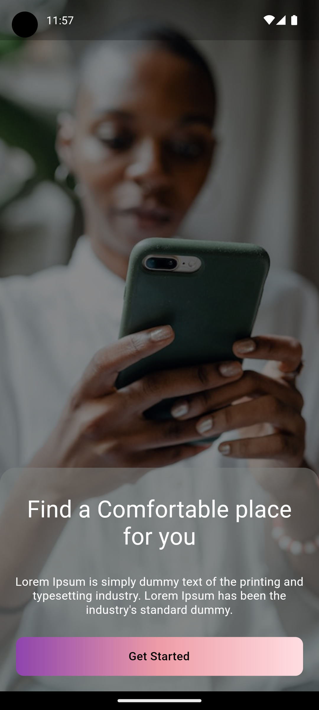
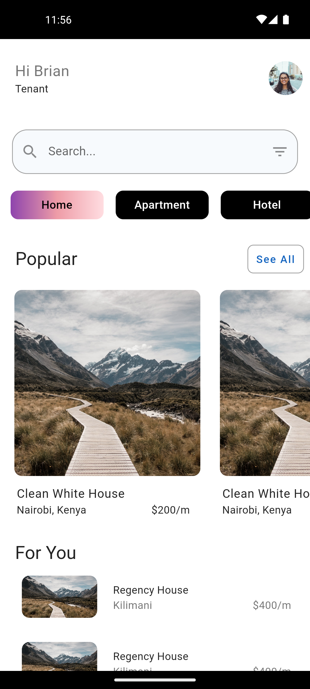
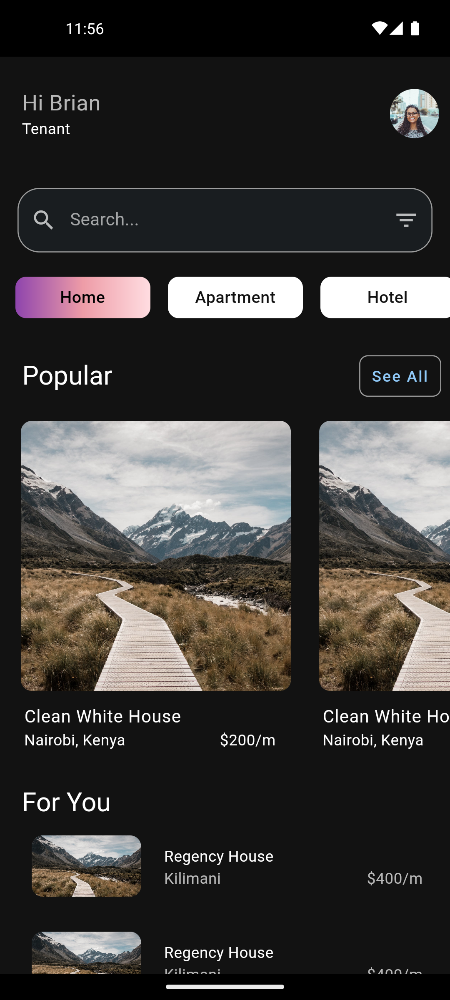
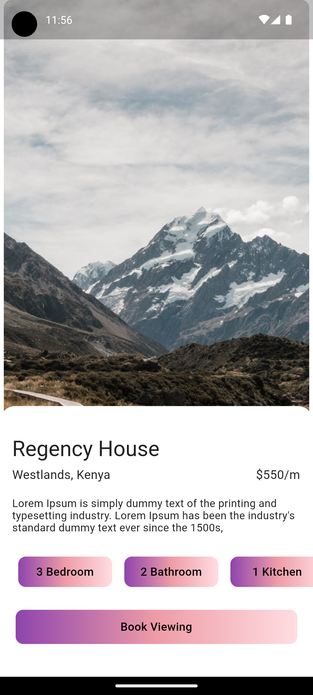
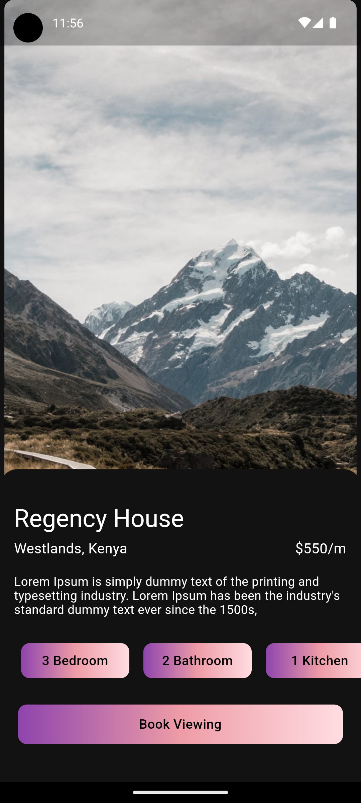

# hao-app-ui

Welcome to the hao-app-ui UI  repository! This repository contains the code for a real estate app UI design developed using Flutter.

This UI implementation was inspired by the designs of [Uplabs](https://www.uplabs.com/posts/real-estate-app-ui-ux-design-da941de2-62f1-47f3-92a5-a8646f70d774)

This is just a starter, nothing comprehensive, but it can be ported to any kind of ecommerce app, by just changing the dummy text and images.


### Screen

-   Onboarding screen
-   Home Screen.
-   Property Detail Scren

## Features
-  Theming (Dark/Light modes)
-  Navigation - Uses Nav 2.0 , A declarative Navigation API
-  State Management - Provider
-  Local Persistence -  Shared Prefs


## Screenshots
 

  

 


## Getting Started
### Prerequisites

To use this repository, you will need the following installed on your machine:
- [Flutter](https://flutter.dev/)
- [Android Studio](https://developer.android.com/studio) (optional, to run on an Android device)

### Installation

Once you have the prerequisites installed, you can clone this repository:

``` 
git clone https://github.com/yourusername/real-estate-app-ui-flutter.git 
```

Next,  open the project in your code editor of choice:
```
cd real-estate-app-ui-flutter 
```

### Usage

To run the app on your local machine, run the following command:

```
flutter run
```

### Contact

If you have questions or feedback about this repository, feel free to contact me at [email](gichukxb@gmail.com).


